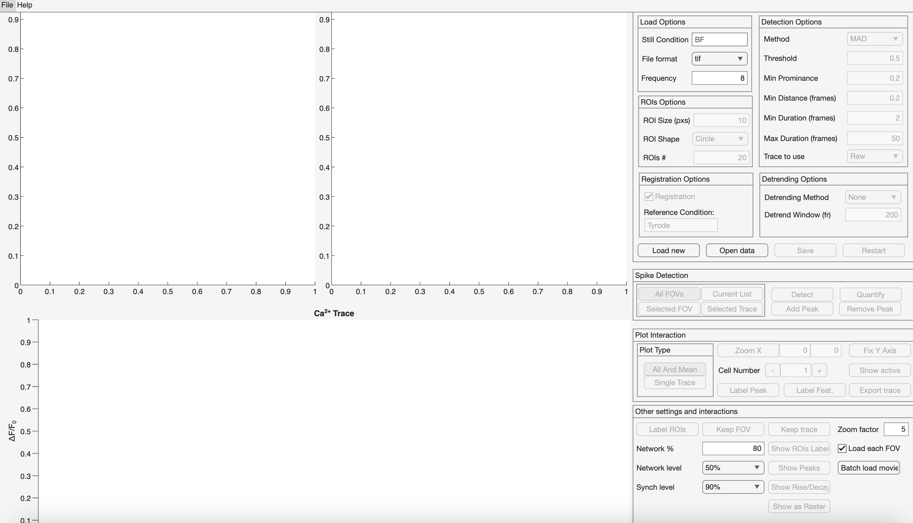
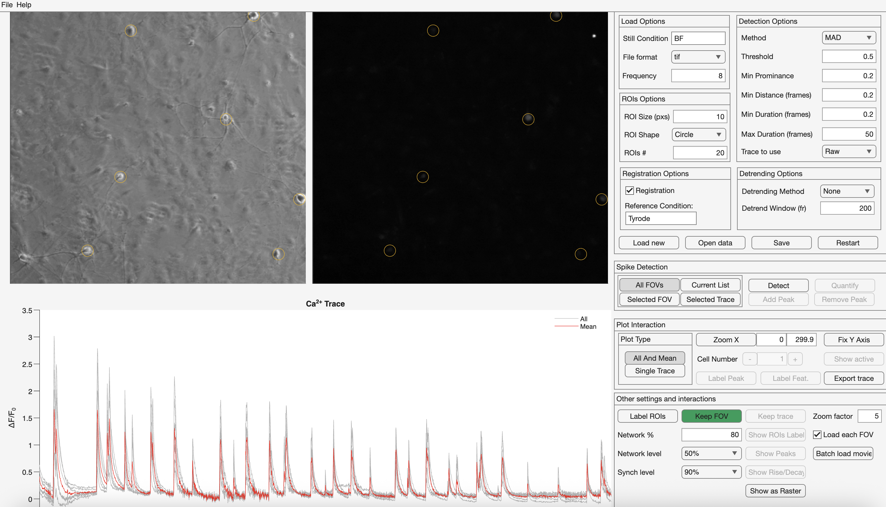
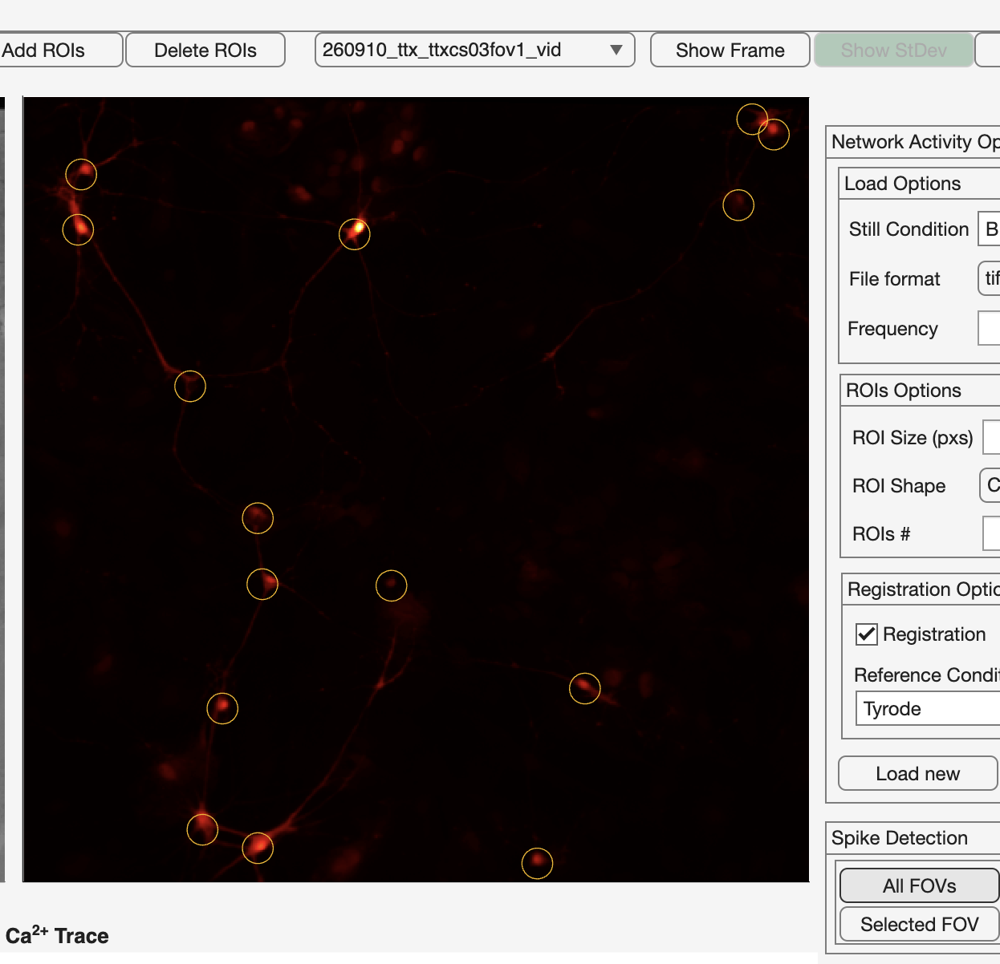
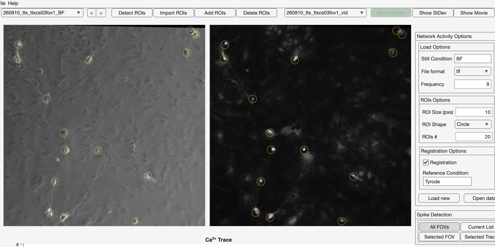
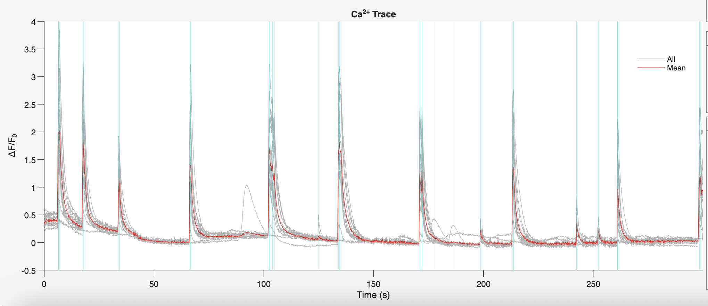
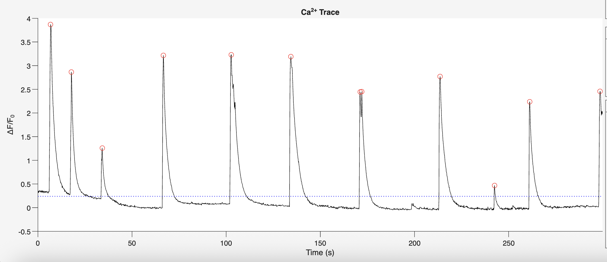

# Calcium Imaging Analysis with sCaSpA

Pipeline for analyzing spontaneous calcium activity in primary mouse cortical cultures with **sCaSpA** (Spontaneous Calcium Spikes Analysis), the MATLAB GUI used in this project to extract per-cell fluorescence traces, detect calcium transients, and quantify network-level dynamics.

The recordings analyzed here come from cultures loaded with Fluo-4 and imaged under widefield epifluorescence at **8 Hz**. Each coverslip was treated for 24 h with vehicle (**ctrl**), tetrodotoxin (**ttx**), or a synaptic blocker cocktail (**bloq**), then washed out and imaged.


<p align="center">
  <video src="media/ttx_network.mp4" controls width="620" muted loop playsinline>
    Your browser can't play this video inline. <a href="media/ttx_network.mp4">Download it here</a>.
  </video>
</p>
<p align="center"><sub><em>Spontaneous network activity in a TTX-pretreated cortical culture, post-washout. Fluo-4, 8 Hz, widefield epifluorescence.</em></sub></p>

---

## Requirements

- MATLAB R2022b or later
- MATLAB toolboxes: **Image Processing**, **Signal Processing**, **Curve Fitting**, **Statistics and Machine Learning**
- This repo bundles both [`sCaSpA-main/`](sCaSpA-main) and its required dependency [`FGA_Toolbox-main/`](FGA_Toolbox-main). Add **both** folders to the MATLAB path (`Home → Set Path → Add with Subfolders`) before launching the GUI.

---

## File-naming convention

sCaSpA pairs each **movie** with its corresponding **still (brightfield) image** by scanning filenames for a shared coverslip token and for a keyword that identifies the still. The still-identifying keyword is whatever you type in **Still Condition** at load time — in this project, `BF`.

For every field of view there are two files in the data folder, named identically except for the `BF` vs. `vid` suffix:

```
260910_bloq_bloqcs01fov1_BF.tif     ← brightfield still (reference image)
260910_bloq_bloqcs01fov1_vid.tif    ← time-lapse movie (960 frames @ 8 Hz)
```

Each token has a specific role:

```
260910  _  bloq  _  bloq cs 01 fov 1  _  BF / vid
  │         │         │   │  │   │  │        │
  │         │         │   │  │   │  │        └── BF = still, vid = movie
  │         │         │   │  │   │  └─────────── FOV number within this coverslip
  │         │         │   │  │   └────────────── literal "fov"
  │         │         │   │  └────────────────── coverslip number for this condition
  │         │         │   └───────────────────── literal "cs" (coverslip)
  │         │         └───────────────────────── condition prefix repeated inside the coverslip ID
  │         └─────────────────────────────────── condition (ctrl | ttx | bloq)
  └───────────────────────────────────────────── recording date (YYMMDD)
```

Only one FOV per coverslip is recorded (`fov1`), so each coverslip contributes a single row to the final data table. Multiple coverslips per condition provide the biological replicates.

Keep every pair of files inside **one data folder** (one folder for the whole experiment, not one per coverslip). sCaSpA will enumerate the pairs automatically on load.

---

## Analysis workflow

Launch the GUI from the MATLAB Command Window:

```matlab
sCaSpA
```

<p align="center">
  
</p>
<p align="center"><sub><em>Figure 1. The sCaSpA main window immediately after launch, before any data is loaded.</em></sub></p>

### 1. Configure the Load Options

In the right-side **Load Options** panel, set:

| Field | Value |
|---|---|
| **Still Condition** | `BF` |
| **File format** | `tif` |
| **Frequency** | `8` |

These three values tell sCaSpA (i) which filename token marks the still image, (ii) the file type to scan for, and (iii) the acquisition rate in Hz — needed to convert frame indices into real time.

### 2. Load the data

Click **Open data** and select the folder containing every brightfield / movie pair for the experiment. The brightfield appears on the **left** panel, the first frame of the movie on the **right**.

Use the dropdowns above the panels to switch between FOVs if more than one is loaded.

<p align="center">
  
</p>
<p align="center"><sub><em>Figure 3. Brightfield still (left) and first movie frame (right) after loading a FOV.</em></sub></p>

### 3. Compute the standard-deviation projection

Click **Show StDev**. The right panel now shows, for every pixel, how much its intensity fluctuated across the 960 frames of the recording. **Active neurons** (whose fluorescence rose and fell with each calcium transient) appear as bright, roughly circular blobs; **inactive or background pixels** stay dark.

This is the image you'll use to decide which cells are worth analyzing.

<p align="center">
  
</p>
<p align="center"><sub><em>Figure 4. Standard-deviation projection — bright blobs mark cells that were active during the recording.</em></sub></p>

### 4. Place ROIs manually

Click **Add ROIs**. Your cursor becomes a crosshair.

The recommended workflow is to **toggle between the two views on the right panel** while placing ROIs:

- Switch to **Show Frame** to see the brightfield — this confirms the ROI sits on a real cell body that took up the Fluo-4 dye (i.e. a cell that was loaded, not debris).
- Switch to **Show StDev** to see which cells were actually active during the recording.

Place each ROI by clicking the center of a candidate cell **on the right panel** (the panel that currently shows either the brightfield or the StDev projection). ROIs placed on the right panel are automatically mirrored to the brightfield shown on the left.

Click **Add ROIs** again when you're done. sCaSpA will extract a ΔF/F₀ time-series for each ROI across all 960 frames and populate the **Ca²⁺ Trace** plot at the bottom.

To remove a mistakenly placed ROI, click **Delete ROIs**, click the circle you want gone, then click **Delete ROIs** again to deactivate.

<p align="center">
  
</p>
<p align="center"><sub><em>Figure 5. ROIs placed on the StDev projection (right) and automatically mirrored on the brightfield (left).</em></sub></p>

### 5. Set the detection parameters

In the **Detection Options** panel, use the values that were calibrated for this project:

| Field | Value |
|---|---|
| **Method** | `MAD` |
| **Threshold** | `0.5` |
| **Min Prominence** | `0.2` |
| **Min Distance (frames)** | `0.2` |
| **Min Duration (frames)** | `0.2` |
| **Max Duration (frames)** | `50` |
| **Trace to use** | `Raw` |

In **ROIs Options**: `ROI Size (pxs) = 10`, `ROI Shape = Circle`, `ROIs # = 20`.

In **Detrending Options**: `Detrending Method = None`, `Detrend Window (fr) = 200`.

In **Registration Options**: leave **Registration** unchecked and leave **Reference Condition** blank.


### 6. Run automatic peak detection

Decide the scope first (the four buttons on the left of the **Spike Detection** panel):

- **All FOVs** — run detection on every loaded recording.
- **Selected FOV** — run only on the FOV currently selected in the top dropdown.
- **Selected Trace** — run only on the single ROI currently highlighted in the trace plot.

For an initial pass, select **All FOVs** and click **Detect**. The algorithm uses the detection parameters above to mark every candidate peak as a blue vertical stripe in the Ca²⁺ Trace plot.

<p align="center">
  
</p>
<p align="center"><sub><em>Figure 7. Ca²⁺ Trace plot immediately after Detect — each blue vertical stripe marks a detected peak.</em></sub></p>

### 7. Refine the detections per trace

Automatic detection is a starting point; it should always be reviewed cell by cell.

Switch the **Plot Type** to **Single Trace** and use the **Cell Number** `–` / `+` buttons to step through ROIs one at a time. For each cell:

- Use **Zoom X** (set a start and end time in seconds) to focus on a short time window.
- Toggle **Fix Y Axis** so the vertical scale stays stable while you flip between cells.
- **Add Peak** → click a missed peak on the trace. The algorithm snaps to the local maximum.
- **Remove Peak** → click a falsely detected peak to delete it.
- Right-click while in Add/Remove mode to undo the last action.

If you want to re-run automatic detection for just the cell you're inspecting (e.g. after changing a threshold), select **Selected Trace** at the top of the Spike Detection panel and click **Detect** again — only this ROI's peaks will be recomputed.

<p align="center">
  
</p>
<p align="center"><sub><em>Figure 8. Single Trace view after manual review — automatic peaks (blue) with manual additions and deletions.</em></sub></p>

The default values in the **Other settings and interactions** panel (Network %, Network level, etc.) work well for this project and do not need to be changed.

### 8. Quantify

Once peaks are reviewed for every cell, click **Quantify** (with **All FOVs** selected). This computes per-cell kinetics (rise time, decay, duration at different peak-height fractions, prominence) and network-level metrics (burst frequency, synchronicity, % isolated spikes), using the peak locations from the previous step.

### 9. Export

Go to **File → Export → Analysis**. In the dialog that opens, select only the metadata and metric columns you need for downstream analysis — leave the raw-array columns unticked (they do not export cleanly to CSV).

For this project the exported columns are:

**Metadata:** `CellID`, `CoverslipID`, `ExperimentID`, `Fs`, `KeepFOV`

**Network and single-cell metrics:** `NetworkFrequency`, `SilentCells`, `MeanFrequency`, `MeanInterSpikeInterval`, `MeanSynchronicity`, `MeanIsolated`, `MeanTimeToRise`, `MeanDuration25`, `MeanDuration50`, `MeanDuration75`, `MeanDuration90`, `MeanProminence`

The output is one CSV with one row per FOV.

---

## Exported metrics

Each metric below is the across-cells mean for one FOV, computed by sCaSpA at the Quantify step.

| Column | What it measures |
|---|---|
| `CellID` | Full filename of the movie (identifies the recording). |
| `CoverslipID` | Coverslip identifier (`<condition>cs<NN>fov<N>`), one coverslip = one FOV. |
| `ExperimentID` | Date + coverslip, used as a session identifier. |
| `Fs` | Acquisition frame rate in Hz (8 for this project). |
| `KeepFOV` | 1 if the FOV passes quality control, 0 if it should be excluded downstream. |
| `NetworkFrequency` | How often the network produces a synchronized burst, in bursts per unit time. A network burst is counted when the fraction of cells firing within a short overlap window exceeds the **Network %** threshold. |
| `SilentCells` | Percentage of ROIs in the FOV that fired no detectable spike during the recording. |
| `MeanFrequency` | Average firing rate across active cells. |
| `MeanInterSpikeInterval` | Average time (seconds) between consecutive spikes within a cell, averaged across cells. Short intervals with high variability indicate bursting. |
| `MeanSynchronicity` | Average percentage of the network that participates in each synchronous event. |
| `MeanIsolated` | Percentage of spikes that occur **outside** any detected network burst — a measure of how much firing is uncoordinated. |
| `MeanTimeToRise` | Time (seconds) from the onset of a calcium transient to its peak. Reflects the kinetics of calcium influx. |
| `MeanDuration25` | Full width of the calcium transient at 25 % of its peak prominence (seconds). |
| `MeanDuration50` | Full width at 50 % of peak (Full-Width at Half-Maximum, seconds). |
| `MeanDuration75` | Full width at 75 % of peak (seconds). |
| `MeanDuration90` | Full width at 90 % of peak (seconds); captures how narrow the top of the transient is. |
| `MeanProminence` | Peak amplitude above local baseline, expressed in ΔF/F₀ units. Reflects the strength of the calcium signal per event. |

---

## Note on the software

sCaSpA (v1.3#3) is actively developed and a few GUI features are not yet fully implemented. The analysis pipeline described above only relies on the features that are working as intended. If you encounter a bug or a missing feature while extending the analysis, please open an issue or submit a pull request rather than working around it in post-processing.

## Results

For some proof of concept experimental results please access the document: `report.md`