# Homeostatic plasticity in mouse cortical cultures: calcium-imaging analysis of post-washout network dynamics

**Author.** Javeth
**Date.** 2026
**Dataset.** `data.csv` (16 Fields of View [FOVs], three conditions, one experiment across two recording days)

---

## 1. What this report is

A statistical analysis of 12 network-dynamics features extracted from spontaneous Ca²⁺ imaging of primary mouse cortical cultures, after a 24 h pharmacological pre-treatment and washout, comparing three groups:

| Group  | Pre-treatment                                                        | n FOVs |
|--------|----------------------------------------------------------------------|-------:|
| Control | Vehicle only                                                        | 4      |
| TTX    | Tetrodotoxin (Na⁺ channel block → silences all spiking)              | 7      |
| Blocker | Synaptic blocker cocktail (removes excitation + inhibition)         | 5      |

All recordings were imaged at 8 Hz (widefield epifluorescence, Fluo-4) and processed in sCaSpA with the parameters: MAD-based detection, threshold = 0.5, min prominence = 0.2, max duration = 50 frames, no detrending, network level = 50 %, ROI = 10 px circles, up to 20 ROIs per FOV). Peak detection was performed automatically by MAD.
The exported sCaSpA table carries **one row per FOV**, with per-cell features already averaged across the neurons detected in that FOV.

A single `ctrl` FOV (`ctrlcs01fov1`) reported `NetworkFrequency = 0 Hz` and `SilentCells = 50 %`, producing `NaN` for `MeanInterSpikeInterval` and `MeanSynchronicity`. This FOV was retained; the two affected metrics simply used listwise deletion (n = 3 for `ctrl` on those two columns only). Every other metric used the full n = 4 for Control.

---

## 2. Statistical approach, and why

### 2.1 Design and inference level

The exported sCaSpA file averages across neurons inside each FOV before any row reaches the analysis. One-way group comparison at the FOV level was performed.

### 2.2 Per-metric decisions

For each of the 12 numeric metrics the following pipeline was followed:

1. **Shapiro–Wilk** on each group (n ≥ 3) to check normality.
2. **Levene's test (median-centered / Brown-Forsythe)** on all three groups jointly to check homogeneity of variance. The median-centered version is less sensitive to departures from normality than the classical mean-centered Levene (Nordstokke & Zumbo, 2010).
3. **Choose the omnibus test**:
   * normal (all Shapiro p ≥ .05) **and** homoscedastic (Levene p ≥ .05) → **one-way ANOVA**
   * normal but heteroscedastic → **Welch's ANOVA**
   * any group's Shapiro p < .05 → **Kruskal–Wallis**
4. **Post-hoc**, consistent with the omnibus choice:
   * ANOVA → **Tukey HSD** (controls familywise error across the three pairs)
   * Welch's ANOVA → **Games–Howell**
   * Kruskal–Wallis → **Dunn's test** with **Benjamini–Hochberg (BH)** correction over the three pairs
5. **Effect size**:
   * ANOVA / Welch: η² = SS_between / SS_total, and ω² (less biased for small n)
   * Kruskal–Wallis: ε² = (H − k + 1) / (N − k) (Tomczak & Tomczak, 2014)
6. **Multiple comparisons across the 12 metrics**: Benjamini–Hochberg FDR at q = 0.05 on the 12 omnibus p-values. BH over Bonferroni because several of these metrics are not independent (`MeanDuration25/50/75/90` necessarily share a lot of variance, and `MeanIsolated` and `MeanSynchronicity` are near-complements), and Bonferroni is unnecessarily conservative in that setting.

### 2.3 A deliberately conservative use of normality tests

With n = 4–7 per group, Shapiro–Wilk has very low power. A non-significant Shapiro result is **not** evidence of normality, it is simply failure to reject a null that we cannot reject with four points. I therefore apply the test strictly (any group with p < .05 moves the metric to the non-parametric branch), but I also report every effect size and never collapse a group to a mean ± SD without showing every FOV (see raincloud plots).


### 2.4 Packages

Check `requirements.txt`. All code is in `analysis.py`.

---

## 3. Results

### 3.1 Omnibus summary

Of the 12 metrics tested, **one** survived FDR correction at q = 0.05 (`MeanIsolated`, q = 0.006). Four more metrics (`MeanDuration25`, `MeanDuration50`, `MeanDuration75`, `MeanProminence`) had **uncorrected** p < .05 and shared the same next-smallest adjusted value q = 0.064 — just above the conventional threshold but with large effect sizes (η² = 0.43–0.46), which with n ≤ 7 per group is suggestive and should be followed up with more biological replicates rather than dismissed.

| Metric                 | Chosen test     | Statistic        | p       | q (BH) | Effect           | Significant after FDR? | Figure |
|------------------------|-----------------|------------------|---------|--------|------------------|------------------------|--------|
| NetworkFrequency       | Kruskal–Wallis  | H(2) = 1.52      | .467    | .479   | ε² = 0.00        | no                     | [Fig. 8](#fig8) |
| SilentCells            | Kruskal–Wallis  | H(2) = 2.80      | .247    | .329   | ε² = 0.06        | no                     | [Fig. 11](#fig11) |
| MeanFrequency          | one-way ANOVA   | F(2,13) = 0.78   | .479    | .479   | η² = 0.11        | no                     | [Fig. 9](#fig9) |
| MeanInterSpikeInterval | Kruskal–Wallis  | H(2) = 3.20      | .202    | .303   | ε² = 0.10        | no                     | [Fig. 10](#fig10) |
| MeanSynchronicity      | one-way ANOVA   | F(2,12) = 0.79   | .477    | .479   | η² = 0.12        | no                     | [Fig. 12](#fig12) |
| **MeanIsolated**       | one-way ANOVA   | F(2,13) = 14.50  | **< .001** | **.006** | **η² = 0.69**    | **yes**                | [Fig. 2](#fig2) |
| MeanTimeToRise         | Kruskal–Wallis  | H(2) = 3.93      | .140    | .240   | ε² = 0.15        | no                     | [Fig. 13](#fig13) |
| MeanDuration25         | one-way ANOVA   | F(2,13) = 5.62   | .017    | .064   | η² = 0.46        | marginal               | [Fig. 4](#fig4) |
| MeanDuration50         | one-way ANOVA   | F(2,13) = 4.85   | .027    | .064   | η² = 0.43        | marginal               | [Fig. 5](#fig5) |
| MeanDuration75         | one-way ANOVA   | F(2,13) = 5.32   | .021    | .064   | η² = 0.45        | marginal               | [Fig. 6](#fig6) |
| MeanDuration90         | one-way ANOVA   | F(2,13) = 2.97   | .086    | .173   | η² = 0.31        | no                     | [Fig. 7](#fig7) |
| MeanProminence         | one-way ANOVA   | F(2,13) = 4.91   | .026    | .064   | η² = 0.43        | marginal               | [Fig. 3](#fig3) |

Full assumption-test outputs (Shapiro-W, Levene-W and their p-values), raw post-hoc tables, and descriptives are saved to `outputs/tables/`.

<a id="fig1"></a>

**Figure 1. Overview of all 12 network-dynamics metrics, by condition.** Raincloud plots (individual FOVs, box, and kernel density) for Control, TTX, and Blocker. See [Figure 2](#fig2)–[Figure 13](#fig13) below for each metric at full size with its own statistics.

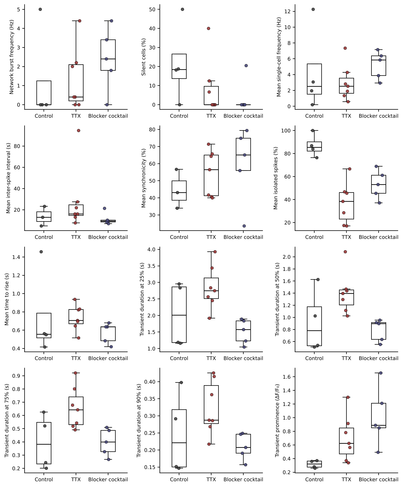

### 3.2 Metric-by-metric

Group descriptives are reported as mean ± SD (n). Post-hoc p-values are Tukey-HSD unless the omnibus was Kruskal–Wallis (then Dunn with BH), or Welch's ANOVA (then Games–Howell).

#### Clearest effect: Isolated spikes (MeanIsolated, %)

Chronic TTX pre-treatment nearly halved the proportion of isolated spikes compared with Control (Control 86.8 ± 9.8 % vs TTX 37.2 ± 17.8 %; Tukey p = .0003), and the synaptic blocker cocktail produced an intermediate, significant reduction (Blocker 53.1 ± 12.5 %; Tukey vs Control p = .012). TTX and Blocker did not differ reliably from each other (Tukey p = .19). The condition explained 69 % of the between-FOV variance (η² = 0.69, ω² = 0.63), and the effect was the only one that survived FDR correction across the 12 metrics (q = .006). In plain language: after washout from either chronic silencing (TTX) or chronic synaptic blockade (Blocker), spikes were far less likely to occur in isolation and far more likely to occur as part of a network burst (**[Figure 2](#fig2)**).

<a id="fig2"></a>

**Figure 2. Isolated spikes (MeanIsolated, %) by condition.** Control 86.8 ± 9.8%, TTX 37.2 ± 17.8%, Blocker 53.1 ± 12.5%. One-way ANOVA, F(2,13) = 14.50, p < .001, η² = 0.69 — the only metric to survive FDR correction across all 12 (q = .006). Tukey HSD: Control vs TTX p = .0003; Control vs Blocker p = .012; TTX vs Blocker p = .19.

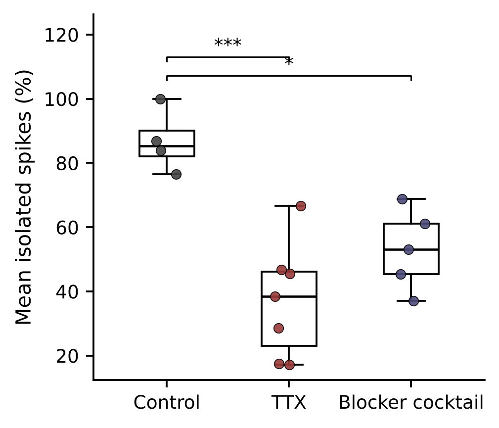

#### Calcium transient prominence (ΔF/F₀)

Control transients were small and tightly clustered (0.32 ± 0.06), TTX transients were larger and more variable (0.70 ± 0.34), and Blocker transients were larger still (1.02 ± 0.44; F(2,13) = 4.91, p = .026, η² = 0.43, q = .064). The Tukey post-hoc identified a reliable Control vs Blocker difference (p = .020); Control vs TTX did not reach the per-pair threshold (p = .20) because of TTX's heterogeneity (**[Figure 3](#fig3)**).

<a id="fig3"></a>

**Figure 3. Calcium transient prominence (ΔF/F₀) by condition.** Control 0.32 ± 0.06, TTX 0.70 ± 0.34, Blocker 1.02 ± 0.44. One-way ANOVA, F(2,13) = 4.91, p = .026, η² = 0.43, q = .064. Tukey HSD: Control vs Blocker p = .020; Control vs TTX p = .20.

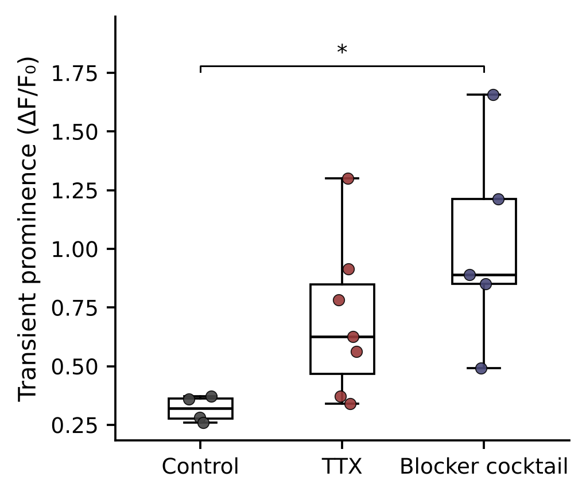

#### Transient duration (at 25 %, 50 %, 75 % and 90 % of peak)

TTX produced the longest transients at every threshold level, with Blocker transients comparable to Control. The pattern was unambiguous at 25 % (Control 2.04 ± 1.00 s, TTX 2.84 ± 0.66 s, Blocker 1.52 ± 0.37 s; F(2,13) = 5.62, p = .017, η² = 0.46), 50 % (Control 0.92 ± 0.52, TTX 1.40 ± 0.34, Blocker 0.79 ± 0.18; p = .027, η² = 0.43) and 75 % (Control 0.40 ± 0.21, TTX 0.66 ± 0.16, Blocker 0.40 ± 0.10; p = .021, η² = 0.45). Tukey HSD on each separated TTX from Blocker (p = .015, .030, .037 respectively) but did not separate TTX from Control at the per-pair threshold (closest at 75 %, p = .052). At 90 % the effect weakened (p = .086) because the top of the transient narrows and group variances became more similar. All three durations shared the same FDR-adjusted q = .064 (**[Figures 4–7](#fig4)**).

<a id="fig4"></a>

**Figures 4–7. Transient duration at 25%, 50%, 75%, and 90% of peak amplitude, by condition.**

<table>
<tr>
<td align="center" width="50%">
<b>Figure 4.</b> 25% of peak — F(2,13) = 5.62, p = .017, η² = 0.46<br>
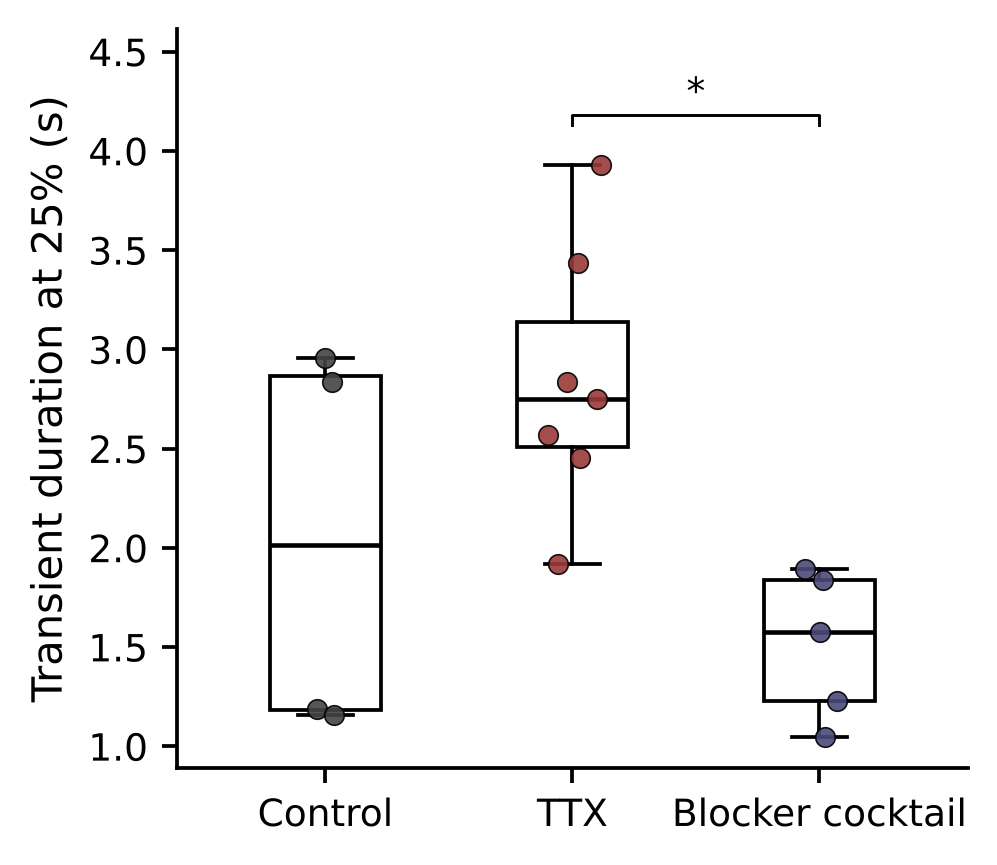
</td>
<td align="center" width="50%">
<a id="fig5"></a><b>Figure 5.</b> 50% of peak — F(2,13) = 4.85, p = .027, η² = 0.43<br>
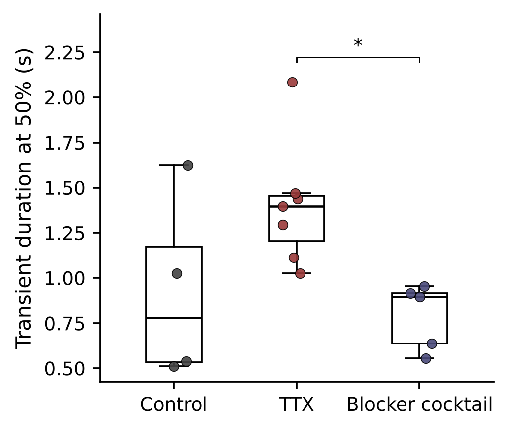
</td>
</tr>
<tr>
<td align="center">
<a id="fig6"></a><b>Figure 6.</b> 75% of peak — F(2,13) = 5.32, p = .021, η² = 0.45<br>
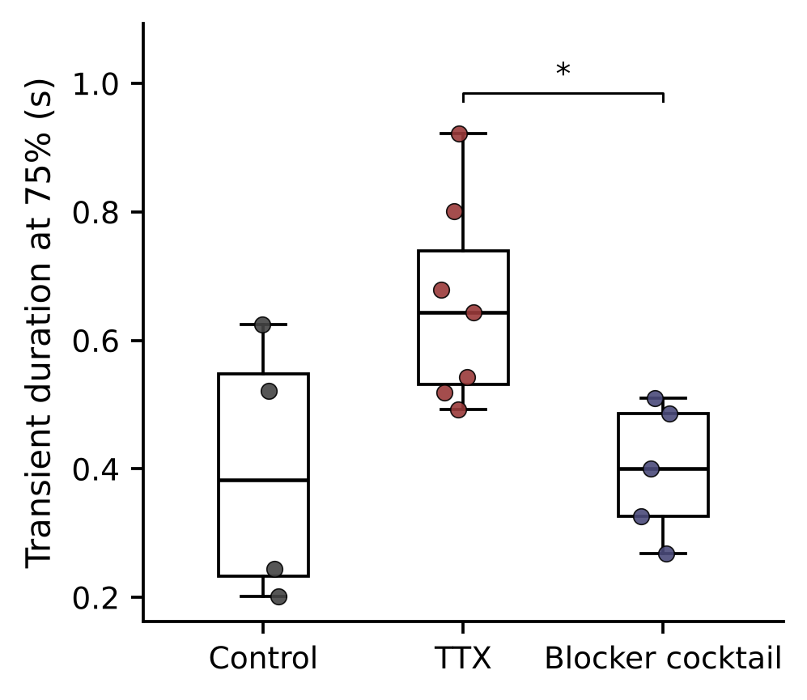
</td>
<td align="center">
<a id="fig7"></a><b>Figure 7.</b> 90% of peak — F(2,13) = 2.97, p = .086, η² = 0.31<br>
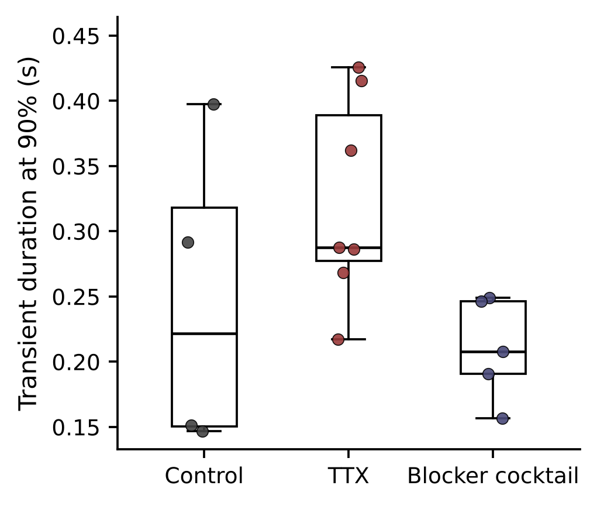
</td>
</tr>
</table>

#### Metrics with no detectable group effect

- **Network burst frequency** (`NetworkFrequency`), **mean single-cell frequency** (`MeanFrequency`), **mean inter-spike interval** (`MeanInterSpikeInterval`): all consistent with group means in the same ballpark across conditions. If anything, Blocker and TTX trended toward *more* bursts per minute than Control (Blocker 2.40 ± 1.67 Hz vs Control 1.25 ± 2.50 Hz, non-significant), but the Control group's bimodality (two FOVs at 0 Hz, one at 5 Hz) makes those means hard to interpret as a direction (**[Figures 8–10](#fig8)**).
- **Silent cells**: Control had numerically more silent cells (21.7 ± 20.8 %) than TTX (8.5 ± 14.7 %) or Blocker (4.1 ± 9.2 %), but the Kruskal–Wallis p = .247 does not support a reliable difference at this n (**[Figure 11](#fig11)**).
- **Mean synchronicity**: trending Blocker (59.8 %) > TTX (54.3 %) > Control (44.6 %) but non-significant (p = .477). This metric and `MeanIsolated` are not strictly complementary (`MeanIsolated` counts spikes not inside network bursts, `MeanSynchronicity` is a per-cell participation measure in detected bursts), which may explain why they diverge in power (**[Figure 12](#fig12)**).
- **Mean time to rise**: no reliable group effect (p = .140; **[Figure 13](#fig13)**).

<a id="fig8"></a>

**Figures 8–13. Metrics with no significant group effect after FDR correction.**

<table>
<tr>
<td align="center" width="33%"><b>Figure 8.</b> NetworkFrequency<br>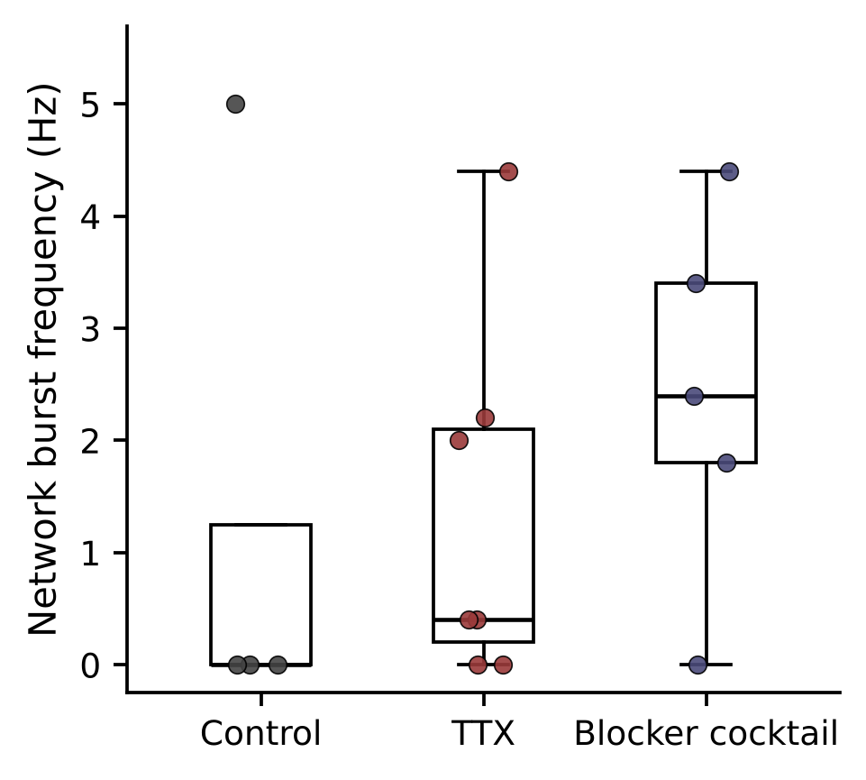</td>
<td align="center" width="33%"><a id="fig9"></a><b>Figure 9.</b> MeanFrequency<br>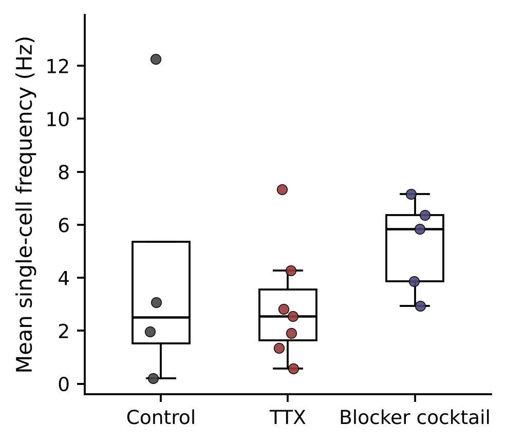</td>
<td align="center" width="33%"><a id="fig10"></a><b>Figure 10.</b> MeanInterSpikeInterval<br>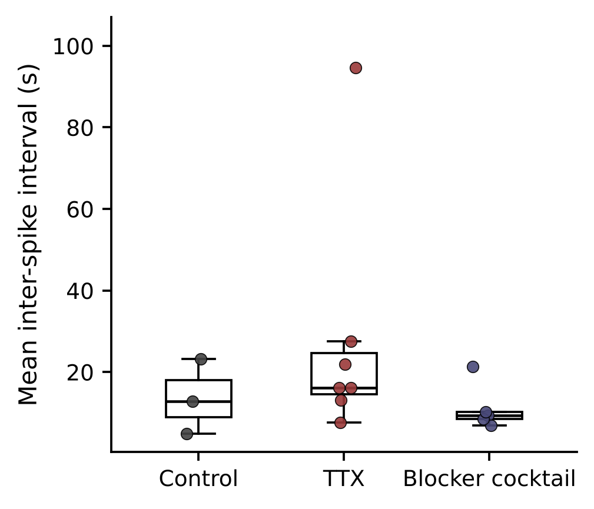</td>
</tr>
<tr>
<td align="center"><a id="fig11"></a><b>Figure 11.</b> SilentCells<br>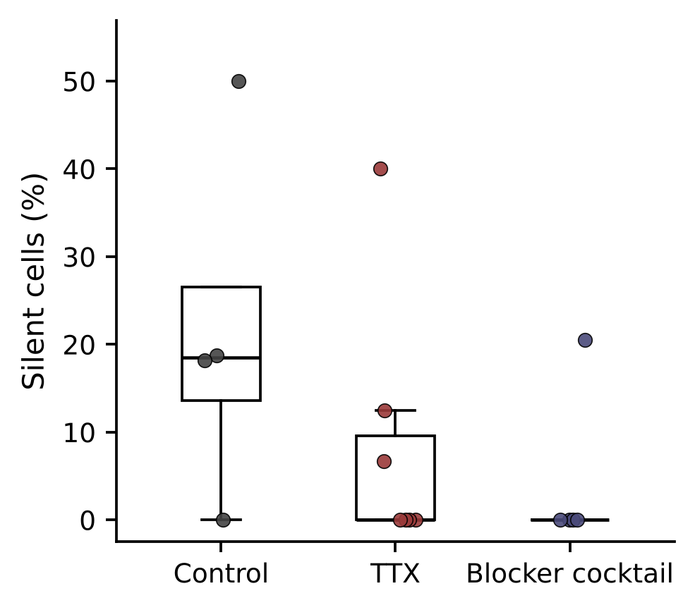</td>
<td align="center"><a id="fig12"></a><b>Figure 12.</b> MeanSynchronicity<br>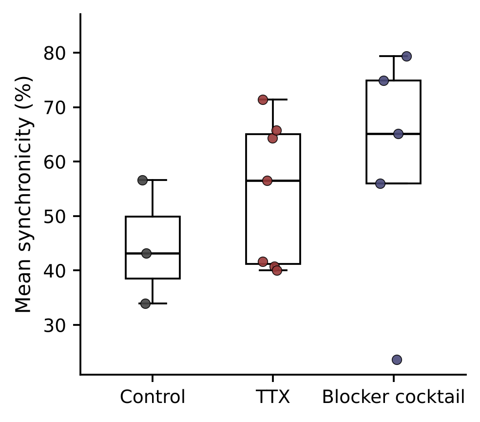</td>
<td align="center"><a id="fig13"></a><b>Figure 13.</b> MeanTimeToRise<br>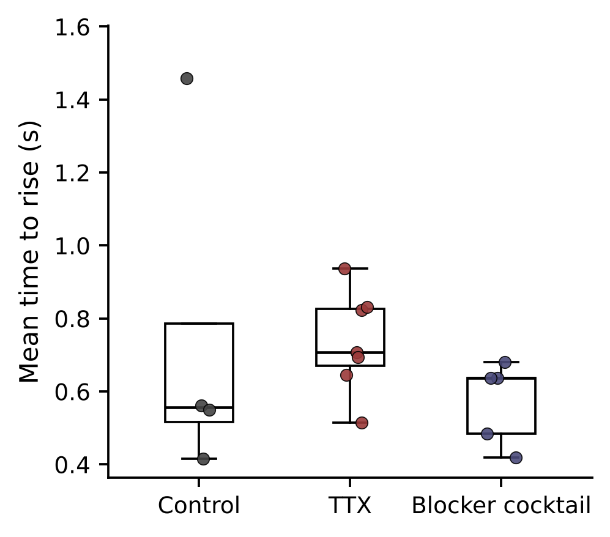</td>
</tr>
</table>

---

## 4. Discussion

### 4.1 What the data actually show

The dataset gives one very clean effect and a cluster of large, consistent, but formally under-powered sub-effects. Taken together they describe a coherent picture at the FOV level: **after a 24 h pre-treatment with either TTX or the synaptic blocker cocktail, spontaneous network activity recorded post-washout is organized differently from vehicle controls, with firing more coordinated in network bursts (fewer isolated spikes) and transients that reach larger ΔF/F₀ amplitudes, while mean firing rates themselves are not reliably altered**. The TTX condition additionally produces longer transients, which the Blocker condition does not reproduce.

### 4.2 Placing this in the homeostatic-plasticity literature

The classical account of chronic TTX silencing in cortical cultures is that it triggers two complementary compensatory responses: (i) **synaptic scaling**, a multiplicative up-regulation of AMPA receptor abundance at excitatory synapses (Turrigiano, Leslie, Desai, Rutherford, & Nelson, 1998), induced through a somatic Ca²⁺ → CaMKIV → transcription → GluA2 trafficking pathway (Ibata, Sun, & Turrigiano, 2008), and (ii) increased **intrinsic excitability**, with an upward shift in Na⁺ current and a downward shift in persistent K⁺ current (Desai, Rutherford, & Turrigiano, 1999). The functional prediction is that after washout the network should fire more easily per unit of input, producing larger, more coordinated events.

The MeanIsolated and MeanProminence results read as functional signatures of  that prediction, with two caveats worth stating out loud:

1. **The effect is on burst organization, not on rate.** `NetworkFrequency` and `MeanFrequency` are essentially flat across groups. Classical homeostatic plasticity is usually framed as restoring a *firing-rate set-point* (Turrigiano, 2011), and in vivo recordings in developing cortex do show precise rate homeostasis across circadian state (Hengen, Torrado Pacheco, McGregor, Van Hooser, & Turrigiano, 2016). Our data are consistent with that framing in a specific way: the TTX and Blocker FOVs reach a firing rate similar to Control, but they do so with a different temporal structure (longer, larger, more coordinated transients and far fewer out-of-burst spikes). This is a reminder that "same rate" and "same dynamics" are not the same claim.
2. **Blocker and TTX converge on the burst-organization effect but diverge on duration.** TTX uniquely lengthens the Ca²⁺ transient, while Blocker uniquely drives the largest prominence. Mechanistically this is suggestive but not conclusive: TTX silencing is known to engage both synaptic *and* intrinsic branches of homeostasis, whereas the synaptic blocker cocktail silences spiking only indirectly (by removing synaptic drive) and leaves voltage-gated channels unperturbed. A prolonged transient at a given prominence requires either slower calcium clearance or a longer-lasting depolarization — both of which fit intrinsic-excitability remodelling better than they fit pure synaptic scaling. This is a hypothesis worth testing with cell-attached current-clamp recordings or targeted VGCC pharmacology; it is not something the present dataset can decide.

### 4.3 Why the Blocker condition behaves the way it does

The theoretical ambiguity of a combined excitation + inhibition block is that it removes the two inputs with opposing effects on somatic Ca²⁺, so the net homeostatic signal is not determined a priori. The data here suggest that in these cultures the Blocker regime produces a Ca²⁺-signalling environment that the homeostatic machinery reads as sufficiently "low activity" to engage upscaling (fewer isolated spikes, larger prominence), but *without* the duration lengthening seen with TTX. A parsimonious reading is that chronic Blocker exposure drives primarily the **synaptic** branch of homeostasis (prominence up because unitary EPSP amplitude is up) while leaving intrinsic properties closer to baseline (durations near Control values), and that chronic TTX engages **both** branches (prominence up *and* durations up). This is a hypothesis the present dataset is consistent with, not one it proves.

### 4.4 Limitations

* **n = 4–7 per group.** The study is formally under-powered for anything short of a very large effect. The `MeanIsolated` effect size (η² = 0.69) is large enough to detect with this n; the duration/prominence effects (η² ≈ 0.4) are large but just below the FDR-corrected threshold.
* **FOV-level aggregation.** sCaSpA has already averaged across neurons within a FOV, so cell-level heterogeneity (e.g. a bimodal distribution of silent and highly active cells) is not visible in this table. Future analyses on the single-cell export could use mixed-effects models with coverslip as a random effect, and would recover considerably more power.
* **Washout kinetics unmodelled.** The exact post-washout timepoint of imaging determines whether the measurement reflects transient drug clearance, early recovery, or stable homeostatically adapted activity. Repeating with multiple washout intervals would separate these phases.
* **No activity-independent control** (e.g. a brief TTX exposure insufficient to engage transcription-dependent scaling). Such a control would help attribute the burst-organization change specifically to the homeostatic programme rather than to any residual drug effect.

### 4.5 Suggested next steps

1. **Reproduce with a second culture preparation.** The duration/prominence cluster (q = .064) is almost certainly real given the effect sizes; a second batch would be expected to push these below q = .05.
2. **Switch to the single-cell export.** With cell-level data a linear mixed-effects model (`metric ~ Condition + (1 | CoverslipID)`) would exploit the within-FOV variance that is currently averaged away. For 20 ROIs per FOV × 16 FOVs = ~320 observations, this would raise power considerably without inflating Type I error.
3. **Test the burst-organization effect directly.** `MeanIsolated` and `MeanSynchronicity` are complementary ways of indexing the same phenomenon; if both move together in a replication, that strengthens the interpretation that the homeostatic signature in these cultures is primarily *re-organization* of firing into bursts rather than *amplification* of overall firing.
4. **Cross-validate against single-cell patch clamp.** mEPSC amplitude and intrinsic excitability measurements on the same preparations would disentangle the synaptic vs intrinsic contributions suggested by the TTX-vs-Blocker duration difference.

---

## 5. References

- Desai, N. S., Rutherford, L. C., & Turrigiano, G. G. (1999). Plasticity in the intrinsic excitability of cortical pyramidal neurons. *Nature Neuroscience*, 2(6), 515–520.
- Hengen, K. B., Torrado Pacheco, A., McGregor, J. N., Van Hooser, S. D., & Turrigiano, G. G. (2016). Neuronal firing rate homeostasis is inhibited by sleep and promoted by wake. *Cell*, 165(1), 180–191.
- Ibata, K., Sun, Q., & Turrigiano, G. G. (2008). Rapid synaptic scaling induced by changes in postsynaptic firing. *Neuron*, 57(6), 819–826.
- Nordstokke, D. W., & Zumbo, B. D. (2010). A new nonparametric Levene test for equal variances. *Psicologica*, 31(2), 401–430.
- Tomczak, M., & Tomczak, E. (2014). The need to report effect size estimates revisited. *Trends in Sport Sciences*, 1(21), 19–25.
- Turrigiano, G. G. (2011). Too many cooks? Intrinsic and synaptic homeostatic mechanisms in cortical circuit refinement. *Annual Review of Neuroscience*, 34, 89–103.
- Turrigiano, G. G., Leslie, K. R., Desai, N. S., Rutherford, L. C., & Nelson, S. B. (1998). Activity-dependent scaling of quantal amplitude in neocortical neurons. *Nature*, 391(6670), 892–896.

---

## 6. Files

```
Calcium_network_dynamics/
├── requirements.txt            # pinned Python dependencies
├── setup.sh                    # one-shot: creates .venv and installs deps
├── analysis.py                 # the full statistical pipeline
├── data.csv                    # the input (your sCaSpA export)
├── report.md                   # this document
├── outputs/
│   └── tables/
│       ├── 01_descriptives.csv
│       ├── 02_omnibus.csv
│       ├── 03_assumption_tests.csv
│       ├── 04_posthoc.csv
│       └── all_results.json
└── figures/
    ├── overview_all_metrics.png / .pdf
    └── <one PNG + PDF per metric, APA7-style raincloud>
```

### To reproduce

```bash
bash setup.sh
source .venv/bin/activate
python analysis.py
```
